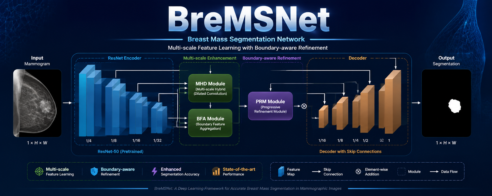

# BreMSNet: Breast Mass Segmentation Network

<p align="center">

</p>

<p align="center">
A deep learning framework for accurate breast mass segmentation in mammographic images.
</p>


## Overview

BreMSNet is a deep learning-based segmentation framework designed for automatic breast mass segmentation from mammographic images.

Accurate segmentation of breast masses remains challenging due to:
- Low contrast between lesions and surrounding tissues
- Large variations in lesion shape and size
- Irregular and ambiguous boundaries

To address these challenges, BreMSNet introduces a multi-component encoder-decoder framework that integrates multi-scale feature learning, contextual enhancement, and boundary-aware refinement for precise lesion delineation.


---

# Architecture

BreMSNet follows a hybrid encoder-decoder architecture consisting of four major components:

## 1. ResNet Encoder

A pretrained ResNet backbone is used to extract hierarchical feature representations from mammographic images.

The encoder captures:

- Low-level spatial details
- High-level semantic information
- Multi-scale lesion representations


## 2. Multi-scale Hybrid Dilated (MHD) Module

The MHD module enhances contextual feature learning using hybrid dilated convolution operations.

It helps the network:

- Capture lesions with different sizes
- Expand receptive fields
- Preserve important spatial information


## 3. Pyramid Refinement Module (PRM)

The Pyramid Refinement Module performs progressive feature refinement through multi-level feature aggregation.

Benefits:

- Improves semantic consistency
- Enhances contextual information
- Strengthens lesion representation


## 4. Boundary-aware Feature Aggregation (BFA)

The BFA module focuses on accurate lesion boundary reconstruction.

It improves:

- Boundary localization
- Edge preservation
- Segmentation accuracy for irregular masses


## 5. Decoder

The decoder progressively restores spatial resolution using:

- Feature fusion
- Skip connections
- Progressive upsampling

The final output is a pixel-level binary segmentation mask.


---

# Key Contributions

BreMSNet focuses on:

- Multi-scale feature representation learning
- Boundary-aware lesion refinement
- Contextual feature aggregation
- Accurate breast mass localization
- Robust mammographic image segmentation


---

# Repository Structure

```
BreMSNet-Medical-Image-Segmentation/

│
├── config.py
├── create_all_pairs.py
├── losses.py
├── metrics.py
├── prepare_cbis_pairs.py
├── prepare_inbreast_masks.py
├── train_cbis.py
├── validate.py
├── test_cbis.py
├── test_inbreast.py
├── utils_image.py
├── visualize_pairs.py
│
└── model/
    ├── __init__.py
    ├── bfa_module.py
    ├── decoder.py
    ├── mhd_module.py
    ├── prm_module.py
    └── resnet_encoder.py

```


---

# Supported Datasets

BreMSNet is designed for mammographic breast mass segmentation.

Supported datasets:

- CBIS-DDSM
- INbreast


Due to medical image licensing restrictions, original datasets and generated masks are not included in this repository.


---

# Installation

Clone the repository:

```bash
git clone https://github.com/Ahmad-xd007/BreMSNet-Medical-Image-Segmentation.git

cd BreMSNet-Medical-Image-Segmentation
```


Install required dependencies:

```bash
pip install -r requirements.txt
```


Main dependencies:

```
Python >= 3.8
PyTorch
Torchvision
OpenCV
NumPy
Pandas
SimpleITK
Scikit-image
Matplotlib
TQDM
```


---

# Dataset Preparation

Prepare CBIS-DDSM dataset:

```bash
python prepare_cbis_pairs.py
```


Prepare INbreast dataset:

```bash
python prepare_inbreast_masks.py
```


---

# Training

Train BreMSNet on CBIS-DDSM:

```bash
python train_cbis.py
```


---

# Validation

Run validation:

```bash
python validate.py
```


---

# Testing

Evaluate on CBIS-DDSM:

```bash
python test_cbis.py
```


Cross-dataset evaluation on INbreast:

```bash
python test_inbreast.py
```


---

# Evaluation Metrics

The framework supports commonly used medical segmentation metrics:

- Dice Similarity Coefficient (DSC)
- Intersection over Union (IoU)
- Sensitivity
- Specificity
- Precision
- Accuracy
- Hausdorff Distance (HD95)


---

# Results

BreMSNet demonstrates strong segmentation capability by combining:

- Multi-scale feature extraction
- Boundary-aware refinement
- Progressive feature decoding
- Context-aware representation learning


Detailed experimental results will be updated with future publications.


---

# Visualization

Example architecture visualization:

```
Input Mammogram
        |
        |
ResNet Encoder
        |
        |
MHD Module
        |
        |
PRM Module
        |
        |
BFA Module
        |
        |
Decoder
        |
        |
Segmentation Mask
```


---

# Citation

If you use this repository in your research, please cite:

```bibtex
@article{BreMSNet,
  title={BreMSNet: Breast Mass Segmentation Network},
  author={Ahmad Ijaz},
  year={2026}
}
```


---

# Contact

**Ahmad Ijaz**

Email:

officialahmed000@gmail.com


LinkedIn:

ahmadijaz007


GitHub:

https://github.com/Ahmad-xd007


---

# Acknowledgement

This project is developed for research on deep learning-based medical image segmentation and computer-aided diagnosis in mammography.
